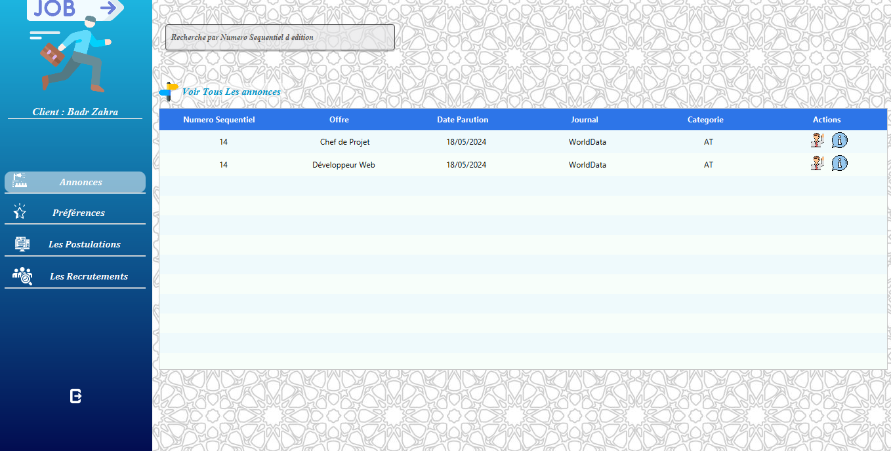
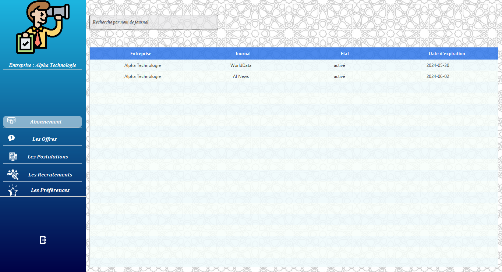
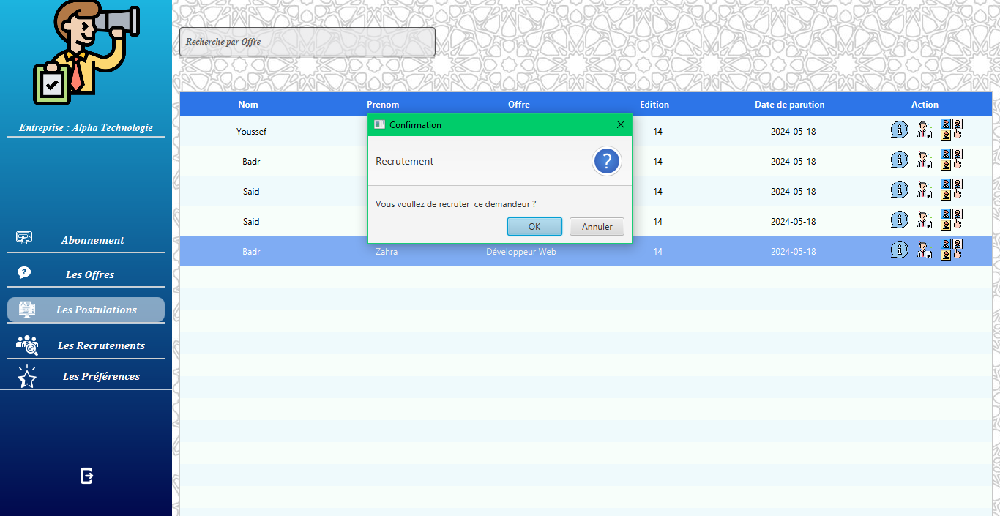

# Agence Recrutement

## Project Overview
Agence Recrutement is a Java-based recruitment agency management system. It provides functionalities for managing job offers, job seekers, companies, subscriptions, and more. The project is designed to streamline the recruitment process for agencies by offering a user-friendly interface and robust backend support.

## Features
- Manage job offers, job seekers, and companies.
- Add, modify, and delete categories, announcements, and journals.
- Dashboard for tracking recruitment activities.
- User authentication and role-based access.
- Subscription management.
- Postulation and preferences management.

## Project Structure
The project follows a modular structure:

- **src/main/java/files/agencerecrutement**: Contains the main application logic, controllers, DAO classes, and models.
  - **Controller**: Handles user interactions and application logic.
  - **DAO**: Data Access Objects for database operations.
  - **Model**: Represents the data structures used in the application.
- **src/main/resources/files/agencerecrutement**: Contains resources such as images, styles, and views.
- **lib**: Includes external libraries like MySQL Connector.

## Prerequisites
- Java Development Kit (JDK) 11 or higher.
- Apache Maven for dependency management.
- MySQL database.

## Setup Instructions
1. Clone the repository to your local machine.
2. Import the project into your favorite IDE (e.g., IntelliJ IDEA, Eclipse).
3. Configure the MySQL database:
   - Import the `agencerecrutement DB.sql` file located in the `lib` folder to set up the database schema.
   - Update database connection details in the `Utilitaire.java` file.
4. Build the project using Maven:
   ```
   ./mvnw clean install
   ```
5. Run the application by executing the `MainApp.java` file.

## Tools and Technologies

The project leverages the following tools and technologies:.

### 🛠️ Technologies & Languages
  
  
  
  

### 🔧 Tools
  
  
  
  


## Screenshots

Here are some screenshots of the application:

### Login Page


### Job Offers


### Company Subscription Management



### Recruit Job Seeker
